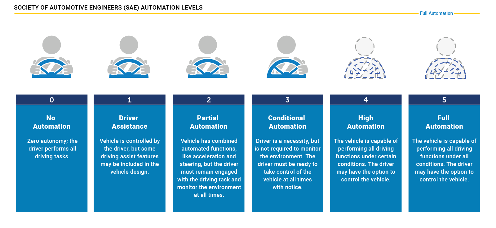
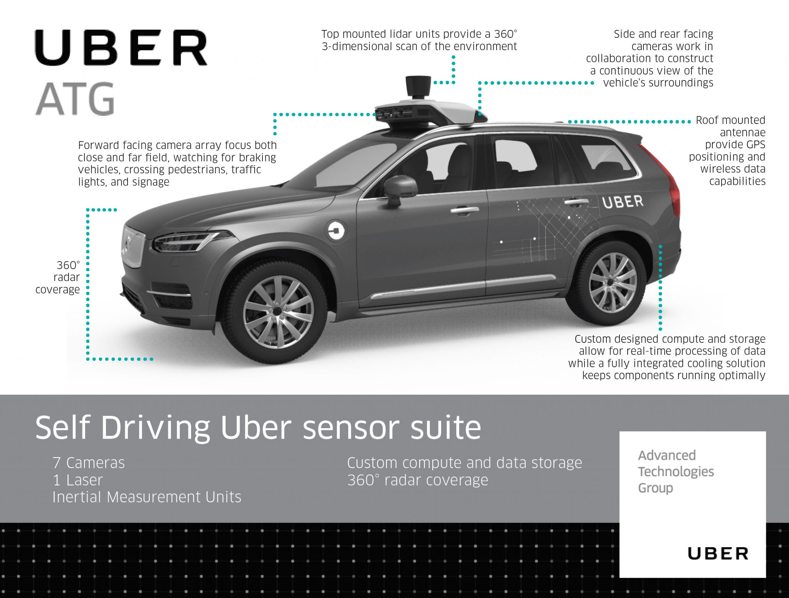
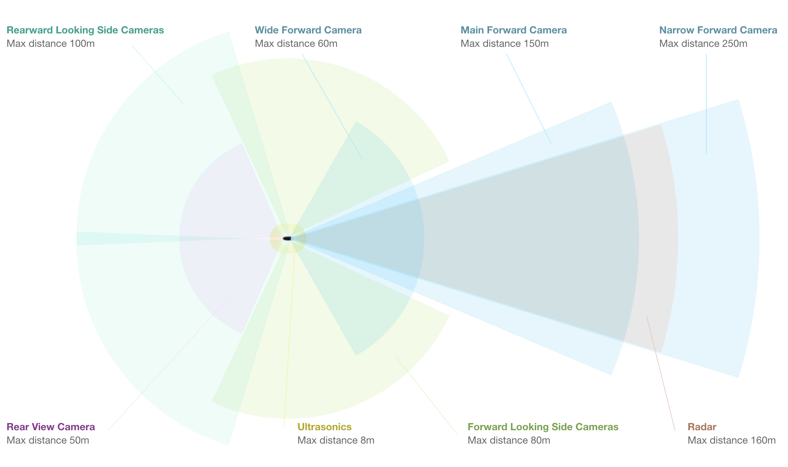

## AV Level

Tesla has been one of the first companies world-wide to introduce a system into the market that promised a high degree of autonomy, the Auto Pilot. On the SAE chart however, this system is „only“ at level 2, that means the driver must remain engaged and should monitor the environment at all times.

Of special interest is a stereo setup consisting of two synchronized cameras, which is able to measure depth by finding corresponding features in both images. The picture below shows the entire host of cameras used by the system. Mercedes states that the stereo camera alone generates a total of 100 gigabytes of data for every kilometer driven.

- UBER AV:

- TESLA AV:

  - **Sonar** : A 360° ultrasonic sonar detects obstacles in an eight-meter radius around the car. The ultrasonic sensors work at any speed and are used to spot objects in close proximity of the car. The ultrasonic sensors can also be used to assist the car when automatically switching lanes. Their range however, compared to the other sensors of the set, is significantly limited and ends at about 8 meters distance.
  
- Cameras: Ubers fleet of modified Volvo XC90 SUVs features a range of cameras on their roofs, plus additional cameras that point to the sides and behind the car. The roof cameras are able to focus both close and far field, watch for braking vehicles, crossing pedestrians, traffic lights, and signage. The cameras feed their material to a central on-board computer, which also receives the signals of the other sensors to create a precise image of the vehicle’s surroundings. Much like human eyes, the performance of camera systems at night is strongly reduced, which makes them less reliable to locate objects with the required detection rates and positional accuracy. This is why the Uber fleet is equipped with two additional sensor types.
- Radar: Radar systems emit radio waves which are reflected off of (many but not all) objects. The returning waves can be analyzed with regard to their runtime (which gives distance) as well as their shifted frequency (which gives relative speed). The latter property clearly distinguished the radar from the other two sensor types as it is the only one who is able to directly measure the speed of objects. Also, radar is very robust against adverse weather conditions like heavy snow and thick fog. Used by cruise control systems for many years, **radar works best when identifying larger objects with good reflective properties**. When it comes to detecting smaller or „soft“ objects (humans, animals) with reduced reflective properties, the radar detection performance drops. Even though camera and radar combine well, there are situations where both sensors do not work optimally - which is why Uber chose to throw a third sensor into the mix.
- Lidar : Lidar works in a similar way to radar, but instead of emitting radio waves it uses **infrared light**. The roof-mouted sensor rotates at a high velocity and builds a detailed 3D image of its surroundings. In case of the Velodyne VLS-128, a total of 128 laser beams is used to **detect obstacles up to a distance of 300 meters**. During a single spin through 360 degrees, **a total of up to 4 million datapoints per second is generated. Similar to the camera, Lidar is an optical sensor. It has the significant advantage however of "bringing its own light source“, whereas cameras are dependent on ambient light and the vehicle headlights**. It has to be noted however, that Lidar performance is also reduced in adverse environmental conditions such as snow, heavy rain or fog. Coupled with low reflective properties of certain materials, a Lidar might thus fail at generating a sufficiently dense point cloud for some objects in traffic, leaving only a few 3D points with which to work. It is thus a good idea to combine Lidar with other sensors to ensure that detection performance is sufficiently hight for autonomous navigation through traffic.  

- **Range** : Lidar and radar systems can detect objects at distances ranging from a few meters to more than 200m. Many **Lidar systems have difficulties detecting objects at very close distances, whereas radar can detect objects from less than a meter**, depending on the system type (either long, mid or short range) . Mono cameras are not able to reliably measure metric distance to object - this is only possible by **making some assumptions about the nature of the world (e.g. planar road surface)**. Stereo cameras on the other hand can measure distance, but only up to a distance of approx. 80m with accuracy deteriorating significantly from there.
- **Spatial resolution** : Lidar scans have a spatial resolution in the order of 0.1° due to the short wavelength of the emitted IR laser light . This allows for **high-resolution 3D scans** and thus characterization of objects in a scene. Radar on the other hand can not resolve small features very well, especially as distances increase. The spatial resolution of camera systems is defined by the optics, by the pixel size on the image and by its signal-to-noise ratio. Details on small object are lost as soon as the light rays emanating from them are spread to several pixels on the image sensor (blurring). Also, when little ambient light exists to illuminate objects, spatial resolution increases as objects details are superimposed by increasing noise levels of the imager.
- **Robustness in darkness** : **Both radar and Lidar have an excellent robustness in darkness**, as they are both active sensors. While daytime performance of Lidar systems is very good, they have an even better performance at night because there is no ambient sunlight that might interfere with the detection of IR laser reflections. Cameras on the other hand have a very reduced detection capability at night, as they are passive sensors that rely on ambient light. Even though there have been advances in night time performance of image sensors, they have the lowest performance among the three sensor types.
- **Robustness in rain, snow, fog** : One of the biggest benefits of radar sensors is their performance under adverse weather conditions. They are not significantly affected by snow, heavy rain or any other obstruction in the air such as fog or sand particles. As an optical system, Lidar and camera are susceptible to adverse weather and its performance usually degrades significantly with increasing levels of adversity.
- **Classification of objects** : Cameras excel at classifying objects such as vehicles, pedestrians, speed signs and many others. This is one of the prime advantage of camera systems and recent advances in AI emphasize this even stronger. Lidar scans with their high-density 3D point clouds also allow for a certain level of classification, albeit with less object diversity than cameras. Radar systems do not allow for much object classification.
- **Perceiving 2D structures** : Camera systems are the only sensor able to interpret two-dimensional information such as speed signs, lane markings or traffic lights, as they are able to measure both color and light intensity. This is the primary advantage of cameras over the other sensor types.
- **Measure speed** : **Radar can directly measure the velocity** of objects by exploiting the Doppler frequency shift. This is one of the primary advantages of radar sensors. Lidar can only approximate speed by using successive distance measurements, which makes it less accurate in this regard. **Cameras, even though they are not able to measure distance, can measure time to collision** by observing the displacement of objects on the image plane. This property will be used later in this course.
- **System cost** : Radar systems have been widely used in the automotive industry in recent years with current systems being highly compact and affordable. The same holds for mono cameras, which have a price well below US$100 in most cases. Stereo cameras are more expensive due to the increased hardware cost and the significantly lower number of units in the market. Lidar has gained popularity over the last years, especially in the automotive industry. Due to technological advances, its cost has dropped from more than US$75,000 to below US$5,000. Many experts predict that the cost of a Lidar module might drop to less than US$500 over the next years.
- **Package size** : Both radar and mono cameras can be integrated very well into vehicles. Stereo cameras are in some cases bulky, which makes it harder to integrate them behind the windshield as they sometimes may restrict the driver's field of vision. Lidar systems exist in various sizes. The 360° scanning Lidar is typically mounted on top of the roof and is thus very well visible. The industry shift towards much smaller solid-state Lidar systems will dramatically shrink the system size of Lidar sensors in the very near future.
- **Computational requirements** : Lidar and radar require little back-end processing. While cameras are a cost-efficient and easily available sensor, they require significant processing to extract useful information from the images, which adds to the overall system cost.

## Camera Basic:

As mentioned before, the projection of points in 3D space onto the image plane does not directly correspond to what we see in actual digital images, which are made up of thousands of picture elements or pixels. To understand how images can be expressed in discrete pixels, we need to take a closer look at the above-mentioned camera model once more. In the figure below, the camera center is shown with a position OO in space along with its own coordinate system with axes ii, jj and kk, where kk is pointing into the direction of the image plane. The position C'C 
′
  where kk intersects the image plane is called the principal point and represents the center of the image coordinate system.
  

The first step after projecting a point PP in space onto the image plane is thus to subtract the principal point coordinates so that the discrete image has its own coordinate system centered in e.g. the lower left corner of the image plane

The second step in the transformation process is to move from metric to pixel coordinates. To do so, we can use parameters kk and ll provided by the calibration procedure which convert meters to pixels and which can be easily integrated into the projection equations as seen below. **Note that in image coordinates, the y-axis has its origin in the upper-left corner and is pointing downwards.**

