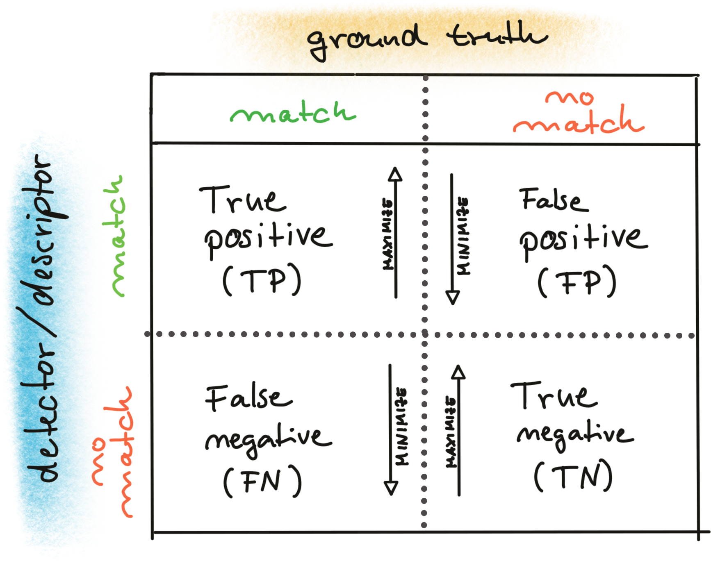

# About the detector:
BRISK,BRIEF, ORB, FREAK, AKAZE are binary hamming class descriptors(type=0,CV_8U) and need to use HAMMING Norm to compute,others are float descriptor(type=5  CV_32F) and need to use L2_Norm to computer
## structure

Point2f(x,y)
```
template<typename _Tp> inline
Point_<_Tp>::Point_()
    : x(0), y(0) {}
```

KeyPoint:
```
inline
KeyPoint::KeyPoint(Point2f _pt, float _size, float _angle, float _response, int _octave, int _class_id)
    : pt(_pt), size(_size), angle(_angle), response(_response), octave(_octave), class_id(_class_id) {}
```

DMatch:
```
inline
DMatch::DMatch(int _queryIdx, int _trainIdx, float _distance)
    : queryIdx(_queryIdx), trainIdx(_trainIdx), imgIdx(-1), distance(_distance) {}
```

## compare strings
```
int normType = descriptorType.compare("DES_BINARY") == 0 ? cv::NORM_HAMMING : cv::NORM_L2;
```

## Manipulating Matrices

```
    for (int r = 230; r < 250; r++)
    {
        //loop over all columns and set matrix elements to 255
        for (int c=0;c<m1_8u.cols;c++) {
            m1_8u.at<unsigned char>(r, c) = 255;
        }

    }
```

## Loading sequences images
```
    std::vector<cv::Mat> imgList;
    for(int i=5;i<=7;i++) {
        //string cnncatenation
        ostringstream imgNumber; //include sstream
        imgNumber << setfill('0') << setw(5) <<i; //include iomanip, total width is 5
        string fileName = "./img" + imgNumber.str() + ".png";

        cv::Mat img;
        img =cv::imread(fileName);
        imgList.push_back(img);
    }
```
It is important to handle large amounts of data in a smart way so that images and other structures are not needlessly copied
```
    for (auto it = imgList.begin(); it != imgList.end();it++) { //auto == vector<cv::Mat>::iterator

        cv::imshow(windowname, *it);
        cv::waitKey(0); 
```

## DrawPoints
it must be palced before imshow block(before sting... namedWindow... )
```
cv::drawKeypoints(source, keyPoints, dest, cv::Scalar::all(-1), cv::DrawMatchesFlags::DRAW_RICH_KEYPOINTS);  //cv::Scalar::all(-1) color random
```
## Filter2D
apply kernel to images
```
    cv::Mat blurred = imgGray.clone();
    float sobel_x[9] = {-1, 0, +1, -2, 0, +2, -1, 0, +1};
    cv::Mat kernel_x = cv::Mat(3, 3, CV_32F, sobel_x);
    cv::filter2D(blurred, result_x, -1, kernel_x, cv::Point(-1, -1), 0, cv::BORDER_DEFAULT);
    cv::GaussianBlur(imgGray, blurred, cv::Size(filterSize, filterSize), stdDev);
```

## NMS
```
    std::vector<cv::KeyPoint> keyPoints;
    double maxOverlap = 0.0;

    for(size_t i=0;i<dst_norm.rows;i++){
        for(size_t j=0;j<dst_norm.cols;j++) {
            int response = (int)dst_norm.at<float>(i,j); //Harris response matrix, its a float matrix
            if(response > minResponse) { //store the pointd above the threshold
                cv::KeyPoint kpt;
                kpt.pt = cv::Point2f(j,i); //point coords, you shoule switch the i, j!!!
                kpt.size = 2 * apertureSize; //size
                kpt.response = response; //response value

                bool bOverlap = false;
                for(auto it = keyPoints.begin(); it!=keyPoints.end(); ++it) {
                    double kptOverldap = cv::KeyPoint::overlap(kpt, *it);
                    if(kptOverldap > maxOverlap) {
                        bOverlap = true; // first to determine overlap, then compare response value
                        if(kpt.response > it->response) {
                            *it = kpt;
                            break;  //successfuly replace/update one KeyPoint and exit, as others left are already have processed not overlap
                        }
                    }
                }
                if(!bOverlap)
                    keyPoints.push_back(kpt); //directly store the ptr not below the threshold and ready to be compred in next response map loop
            }
        }
    }
```
## Feature Detect
```
vector<cv::KeyPoint> kpt;
cv::Ptr<cv::FeatureDetector> detector;
detector = cv::d_name::create(arg1,...);

t = (double)cv::getTickCount();
detector->detect(source, kpt);
t = ((double)cv::getTickCount() - t) / cv::getTickFrequency();//measure the running time in ms
```

## Extract Descriptor
```
cv::Mat desc;
cv::Ptr<cv::DescriptorExtractor> descriptor;
descriptor =  cv::d_name::create(arg1,...);
descriptor->compute(source, kpt, desc);
```

## Descriptor Matcher
Represention(Binary or not) -> Match method(Brute Force or kd-tree based FLANN(ML)) -> K-NN number(best or filter by distance ratio) 

```
vector<cv::DMatch> matches;
cv::Ptr<cv::DescriptorMatcher> matcher;
matcher = cv::M_name::create(normType, crossCheck); //BFMatcher::create(normType, //crossCheck);DescriptorMatcher::create(cv::DescriptorMatcher::FLANNBASED);
matcher->match(descSource, descRef, matches); 
```

## KNN with distance Ratio threshold
```
        vector<vector<cv::DMatch>> knn_matches;
        double t = (double)cv::getTickCount();
        matcher->knnMatch(descSource, descRef, knn_matches, 2); // finds the 2 best matches
        t = ((double)cv::getTickCount() - t) / cv::getTickFrequency();
        cout << " (KNN) with n=" << knn_matches.size() << " matches in " << 1000 * t / 1.0 << " ms" << endl;

        // filter matches using descriptor distance ratio test
        double minDescDistRatio = 0.8;
        for (auto it = knn_matches.begin(); it != knn_matches.end(); ++it)
        {

            if ((*it)[0].distance < minDescDistRatio * (*it)[1].distance)
            {
                matches.push_back((*it)[0]);
            }
        }
```

## Match Performance



