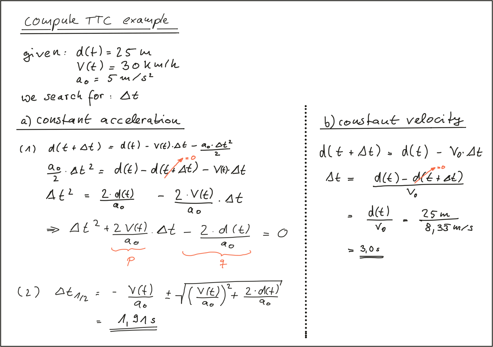

## TTC model and compute




The following code searches for the closest point in the point cloud associated with t_0 and t_1
```
struct LidarPoint { // single lidar point in space
    double x, y, z; // point position in m
    double r; // point reflectivity in the range 0-1
};

void computeTTCLidar(std::vector<LidarPoint> &lidarPointsPrev, 
                     std::vector<LidarPoint> &lidarPointsCurr, double &TTC)
{
    // auxiliary variables
    double dT = 0.1; // time between two measurements in seconds

    // find closest distance to Lidar points 
    double minXPrev = 1e9, minXCurr = 1e9;
    for(auto it=lidarPointsPrev.begin(); it!=lidarPointsPrev.end(); ++it) {
        if (abs(it->y) <= laneWidth / 2.0) //filter out the ptr outside out lane
          minXPrev = minXPrev>it->x ? it->x : minXPrev;
    }

    for(auto it=lidarPointsCurr.begin(); it!=lidarPointsCurr.end(); ++it) {
        if (abs(it->y) <= laneWidth / 2.0)
          minXCurr = minXCurr>it->x ? it->x : minXCurr;
    }

    // compute TTC from both measurements
    TTC = minXCurr * dT / (minXPrev-minXCurr);
}
```

.png)

.png)


